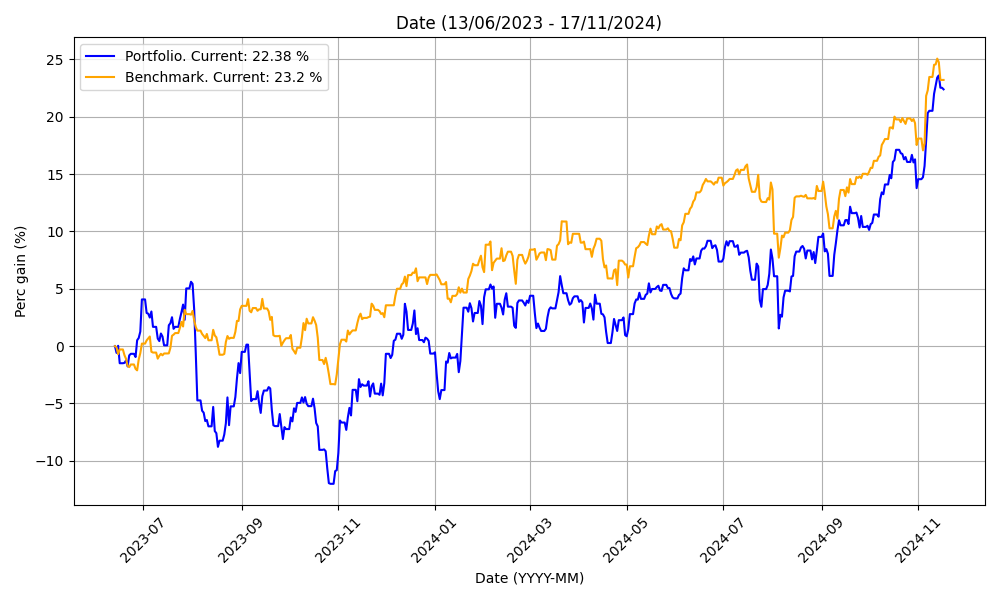
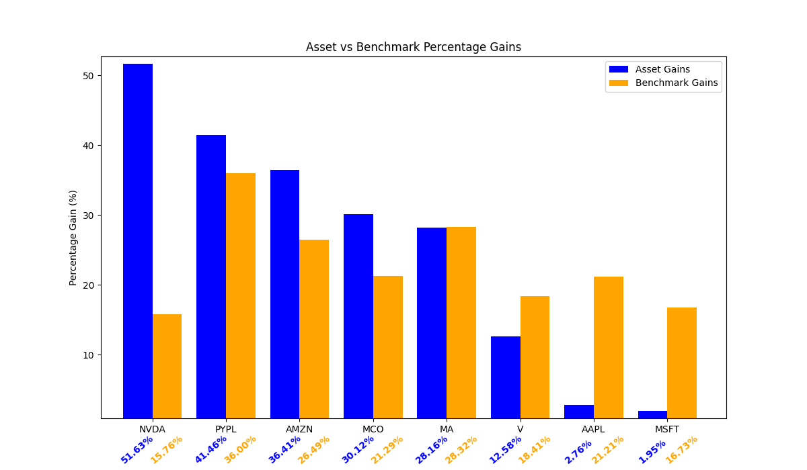

# Stock Portfolio Tracker

The Stock Portfolio Tracker is a tool that allows users to monitor the evolution of their investment portfolio in real-time using data fetched from the Yahoo Finance API. Users can track the assets of their portfolio (for example, stocks) against benchmarks (for example, an S&P500 ETF) simply by importing their portfolio buy/sell transactions. The code tracks the performance against the benchmark in the most fair and realistic manner possible, that is, simulating as if each of your buy/sell transactions was performed by an equal amount in the benchmark of choice.

Some of the reports you will get are the following:

* Asset distribution:

* Portfolio percent evolution:

* Individual assets vs benchmark returns:

## Usage

To use the project, follow these steps:

1. Clone the project.

2. Open the project (preferably with VSCode) and build the `.devcontainer/Dockerfile`.

3. Place your `config.json` and `transactions.csv` in the `data/in` folder. Sample files (`example_config.json` and `example_transactions.csv`) are provided, but you should replace them with your own. Here is a description of each file:
   - `config.json`: Contains configuration settings for the portfolio tracker. Fields:
     - `portfolio_currency`: Indicates the base currency of your portfolio. All reports will be displayed in this currency.
     - `benchmark_ticker`: Ticker to benchmark your portfolio against, as listed in Yahoo Finance.
   
   - `transactions.csv`: Portfolio transactions in CSV format. Fields:
     - `date`: Date of the transaction. Formats accepted: `DD/MM/YYYY`, `DD-MM-YYYY`, `YYYY/MM/DD` and `YYYY-MM-DD`.
     - `transaction_type`: Type of transaction, which can be either `Purchase` or `Sale`.
     - `ticker`: Ticker symbol of the stock as listed in Yahoo Finance.
     - `trans_qty`: The amount of shares purchased/sold. It can be an integer or float in the format `1234.00`. This field is not sensitive to the sign, the code will convert it to the proper sign based on `transaction_type`.
     - `trans_val`: Total value of the transaction expressed in the portfolio currency specified in `config.json`. It should be in the format `1234.00`. This field is not sensitive to the sign, the code will convert it to the proper sign based on `transaction_type`.

4. Run the command provided `.vscode/tasks.json`.

5. View your portfolio performance in the plots that have been generated in `data/out`.
