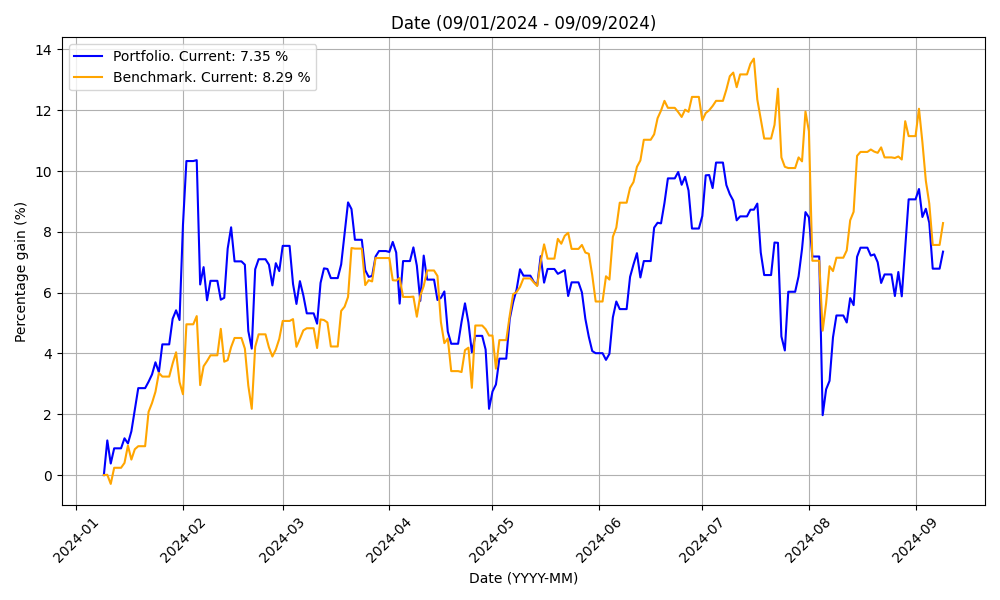

# Stock Portfolio Tracker

The Stock Portfolio Tracker is a tool that allows users to monitor the evolution of their investment portfolio in real-time using data fetched from the Yahoo Finance API. Users can track the assets of their portfolio (for example, stocks) against benchmarks (for example, an S&P500 ETF) simply by importing their portfolio buy/sell transactions. The code tracks the performance against the benchmark in the most fair and realistic manner possible, that is, simulating as if each of your buy/sell transactions was performed by an equal amount in the benchmark of choice.

Some of the reports you will get are the following:

* Asset distribution:


* Portfolio percent evolution:


* Individual assets vs benchmark returns:


## Usage

To use the project, follow these steps:

1. Clone the project.

2. Open the project (preferably with VSCode) and build the `.devcontainer/Dockerfile`.

3. Provide `my_config.json` and `my_transactions.csv` isnide the `data/in` directory:
   - `config.json`: This file contains configuration settings for the portfolio tracker. An example of its contents is shown below:
     ```json
     {
         "portfolio_currency": "EUR",
         "benchmark_tickers": ["IUSA.DE"]
     }
     ```
     - `portfolio_currency`: Indicates the base currency of your portfolio. All reports will be displayed in this currency.
     - `benchmark_tickers`: A list of tickers to benchmark your portfolio against, as they are listed in Yahoo Finance.
   
   - `transactions.csv`: This file contains your portfolio transactions in CSV format with the following fields:
     ```csv
     date,transaction_type,ticker,quantity,value
     23-04-2024,Purchase,MSFT,6.00,2275.53
     28-03-2024,Sale,V,5.00,1297.35
     06-02-2024,Purchase,V,28.00,7151.83
     ```
     - `date`: Date of the transaction. It can be in the format `DD-MM-YYYY` or `YYYY-MM-DD`.
     - `transaction_type`: Type of transaction, which can be either `Purchase` or `Sale`.
     - `ticker`: Ticker symbol of the stock as listed in Yahoo Finance.
     - `quantity`: The amount of shares purchased/sold. It can be an integer or float in the format `1234.00`. This field is not sensitive to the sign, the code will convert it to the proper sign based on `transaction_type`.
     - `value`: Total value of the transaction expressed in the portfolio currency specified in `config.json`. It should be in the format `1234.00`. This field is not sensitive to the sign, the code will convert it to the proper sign based on `transaction_type`.

4. Open the project and build the `.devcontainer/Dockerfile` (very easy with VSCode), and run `stock_portfolio_tracker/main.py`.

5. View your portfolio performance in the plots that have been generated in `data/out`.

## Example Files

The project directory already contains example files that you can use as templates for your configuration and transactions:

- `data/in/config.json`: Example configuration file.
- `data/in/transactions.csv`: Example transaction data in CSV format.

Feel free to modify these files according to your portfolio details.

